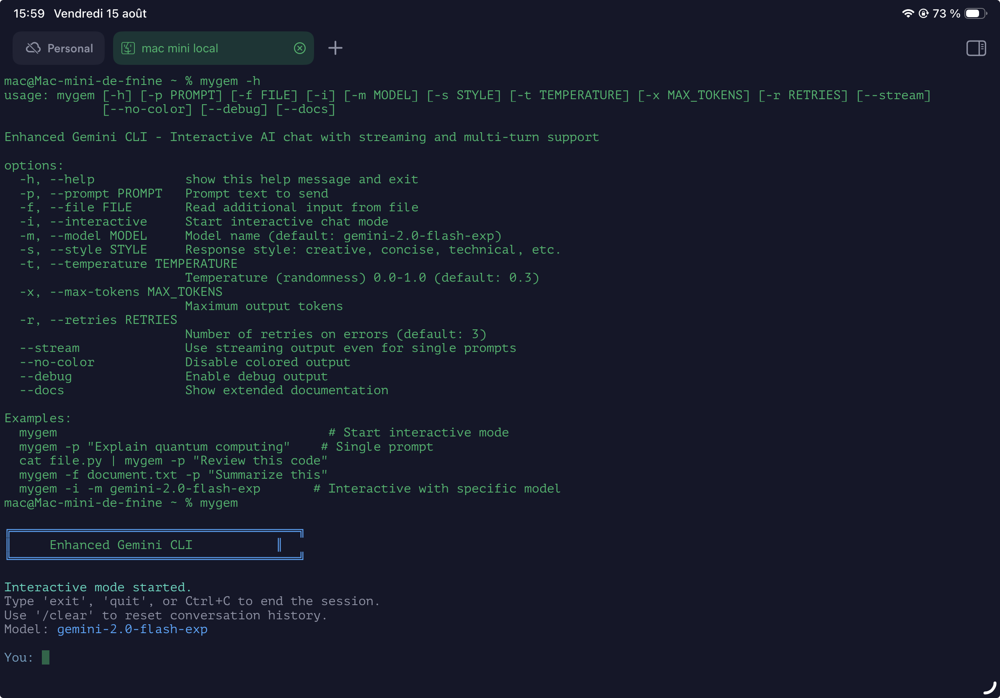

# My enhanced Gemini CLI

A feature-rich command-line interface for Google's Gemini API with streaming responses, multi-turn conversations, and beautiful terminal formatting.



## Features

- **Streaming Responses** - See AI responses appear in real-time
- **Interactive Chat Mode** - Multi-turn conversations with memory
- **Beautiful Terminal UI** - Markdown formatting with syntax highlighting
- **Flexible Input** - Support for prompts, files, and stdin
- **Smart Model Selection** - Easy switching between Gemini models
- **Robust Error Handling** - Automatic retries and graceful failures
- **Auto Color Detection** - Works great in any terminal
- **Zero Dependencies** - Just Python 3 and requests

## Quick Start

### Prerequisites

- Python 3.6 or higher
- `requests` library (`pip install requests`)
- Google AI Studio API key ([Get one here](https://makersuite.google.com/app/apikey))

### Installation

1. **Clone or download the script:**
   ```bash
   wget https://raw.githubusercontent.com/yourusername/gemini-cli/main/gemini-cli
   # OR
   curl -O https://raw.githubusercontent.com/yourusername/gemini-cli/main/gemini-cli
   ```

2. **Make it executable:**
   ```bash
   chmod +x gemini-cli
   ```

3. **Set your API key:**
   ```bash
   export GEMINI_API_KEY="your-api-key-here"
   ```

4. **Install Python dependencies:**
   ```bash
   pip install requests
   ```

5. **Run it:**
   ```bash
   ./gemini-cli
   ```

### Alternative Installation (System-wide)

```bash
# Copy to your local bin directory
sudo cp gemini-cli /usr/local/bin/
sudo chmod +x /usr/local/bin/gemini-cli

# Add API key to your shell profile
echo 'export GEMINI_API_KEY="your-api-key-here"' >> ~/.bashrc
source ~/.bashrc

# Now you can run it from anywhere
gemini-cli
```

## Usage

### Interactive Chat Mode

Start a conversation that remembers context:

```bash
./gemini-cli
# or
./gemini-cli -i
```

**Interactive commands:**
- Type naturally to chat with Gemini
- `/clear` - Reset conversation history
- `exit` or `quit` - End session
- `Ctrl+C` - Force quit

### Single Prompts

Quick one-off questions:

```bash
# Simple prompt
./gemini-cli -p "Explain quantum computing in simple terms"

# With specific model and temperature
./gemini-cli -p "Write a creative story" -m gemini-1.5-pro -t 0.9

# Analyze a file
./gemini-cli -f script.py -p "Review this code for potential issues"

# Process stdin
cat document.txt | ./gemini-cli -p "Summarize this document"

# Combine file and prompt
./gemini-cli -f data.csv -p "Analyze this data and find trends"
```

### Advanced Options

```bash
# Streaming output for single prompts
./gemini-cli -p "Hello world" --stream

# Custom style and parameters
./gemini-cli -p "Explain AI" -s technical -t 0.3 -x 1000

# Debug mode for troubleshooting
./gemini-cli -p "Test" --debug

# Disable colors for scripting
./gemini-cli -p "Test" --no-color
```

## Command Line Options

| Option | Description | Default |
|--------|-------------|---------|
| `-p, --prompt` | Prompt text to send | - |
| `-f, --file` | Read input from file | - |
| `-i, --interactive` | Start interactive mode | Auto-detected |
| `-m, --model` | Gemini model to use | `gemini-2.0-flash-exp` |
| `-s, --style` | Response style (creative, technical, etc.) | - |
| `-t, --temperature` | Randomness (0.0-1.0) | `0.3` |
| `-x, --max-tokens` | Maximum response length | - |
| `-r, --retries` | Number of error retries | `3` |
| `--stream` | Use streaming for single prompts | False |
| `--no-color` | Disable colored output | False |
| `--debug` | Enable debug information | False |
| `--docs` | Show detailed documentation | - |

## Model Selection

Popular Gemini models you can use with `-m`:

- `gemini-2.0-flash-exp` - Latest experimental model (default)
- `gemini-1.5-pro` - Best for complex reasoning and analysis
- `gemini-1.5-flash` - Fast and efficient for most tasks
- `gemini-1.0-pro` - Stable, well-tested model

## 🔧 Configuration

### Environment Variables

```bash
# Required
export GEMINI_API_KEY="your-api-key-here"

# Optional
export MYGEM_MODEL="gemini-1.5-pro"  # Set default model
```

### Temperature Guide

- **0.0 - 0.3**: Focused, consistent, factual responses
- **0.4 - 0.6**: Balanced creativity and consistency  
- **0.7 - 1.0**: Creative, varied, exploratory responses

## 💡 Examples

### Code Review
```bash
./gemini-cli -f app.py -p "Review this Python code for bugs and improvements"
```

### Document Analysis
```bash
./gemini-cli -f report.txt -p "Summarize key findings and create action items"
```

### Creative Writing
```bash
./gemini-cli -p "Write a sci-fi short story about time travel" -s creative -t 0.8
```

### Data Processing
```bash
cat logs.txt | ./gemini-cli -p "Analyze these server logs for errors"
```

### Interactive Learning
```bash
# Start interactive mode and have a conversation
./gemini-cli -i -m gemini-1.5-pro
You: Explain machine learning
Assistant: [Detailed explanation...]
You: Can you give me a practical example?
Assistant: [Builds on previous context...]
```

## 🐛 Troubleshooting

### Common Issues

**"GEMINI_API_KEY not set"**
```bash
export GEMINI_API_KEY="your-key-here"
# Add to ~/.bashrc to persist
```

**"Permission denied"**
```bash
chmod +x gemini-cli
```

**"requests module not found"**
```bash
pip install requests
# or
pip3 install requests
```

**API Rate Limits**
- The tool automatically retries with exponential backoff
- Use `--debug` to see detailed error information
- Consider using a lower temperature or shorter prompts

### Debug Mode

Use `--debug` to see detailed API communication:

```bash
./gemini-cli -p "test" --debug
```

This shows:
- Full API request URLs and payloads
- Response data and timing
- Retry attempts and backoff delays

## 🤝 Contributing

Contributions are welcome! This is a single-file Python script designed to be:

- **Simple**: Easy to understand and modify
- **Portable**: Works anywhere with Python 3 and requests
- **Self-contained**: No complex build process or dependencies

Feel free to:
- Report bugs or request features
- Submit pull requests
- Share usage examples
- Improve documentation

## 📝 License

MIT License - feel free to use, modify, and distribute as needed.

## 🔗 Links

- [Google AI Studio](https://makersuite.google.com/) - Get your API key
- [Gemini API Documentation](https://ai.google.dev/docs) - Official API docs
- [GitHub Repository](https://github.com/yourusername/gemini-cli) - Source code

---

**Made with ❤️ for the command line**

*Experience the power of Gemini AI directly in your terminal with streaming responses, conversation memory, and beautiful formatting.*
